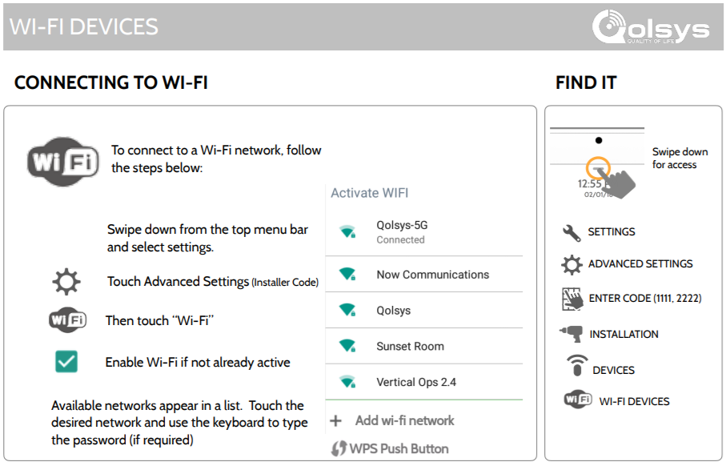
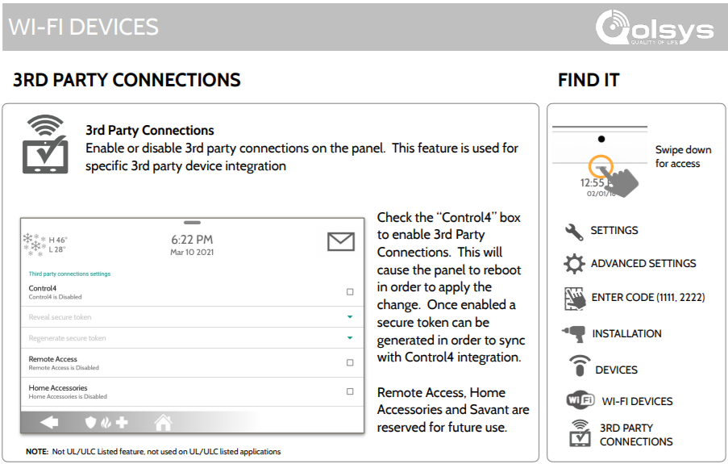

# Qolsys Gateway - `qolsysgw`


[](https://github.com/XaF/qolsysgw/releases)

Qolsys Gateway (`qolsysgw`) is an [AppDaemon][appdaemon]
automation that serves as a gateway between a Qolsys IQ Panel
([2][qolsys-panel-2], [2+][qolsys-panel-2-plus] or [4](qolsys-panel-4))
and [Home Assistant][hass]. Qolsys Gateway works by establishing a connection
to your Qolsys Panel and uses the [MQTT integration of Home Assistant][hass-mqtt].
It takes advantages of the [MQTT discovery][hass-mqtt-discovery]
feature (automatically enabled when you setup the integration) to declare the
device, alarm control panels (for each partition) and different sensors, and
keep them up to date with the information coming from the panel, while
providing you with the means to arm, disarm or trigger your alarm directly
from Home Assistant, manually or through automations.


- [How It Works](#how-it-works)
- [Requirements](#requirements)
- [Installation](#installation)
   - [Installing Home Assistant](#installing-home-assistant)
   - [Installing an MQTT Broker](#installing-an-mqtt-broker)
   - [Installing AppDaemon](#installing-appdaemon)
   - [Installing HACS (optional, recommended)](#installing-hacs-optional-recommended)
   - [Installing Qolsys Gateway](#installing-qolsys-gateway)
      - [With HACS (recommended)](#with-hacs-recommended)
      - [Manually](#manually)
- [Configuration](#configuration)
   - [Configuring the MQTT integration in Home Assistant](#configuring-the-mqtt-integration-in-home-assistant)
   - [Configuring your Qolsys IQ Panel](#configuring-your-qolsys-iq-panel)
   - [Configuring Qolsys Gateway](#configuring-qolsys-gateway)
      - [Required configuration](#required-configuration)
      - [Optional configuration related to the Qolsys Panel itself](#optional-configuration-related-to-the-qolsys-panel-itself)
      - [Optional configuration related to the representation of the panel in Home Assistant](#optional-configuration-related-to-the-representation-of-the-panel-in-home-assistant)
      - [Optional configuration related to MQTT & AppDaemon](#optional-configuration-related-to-mqtt--appdaemon)
- [Other documentation](#other-documentation)
- [Acknowledgements and thanks](#acknowledgements-and-thanks)


## How It Works

Qolsys Gateway is an [async application][asyncio] and has a few parallel
workflows:

1. The communication with the Qolsys Panel

   1. Qolsys Gateway connects to your Qolsys Panel using the configured
      information (hostname, token, port), thanks to a Control4 interface

   2. As soon as the connection is established, Qolsys Gateway requests
      from the panel the information on the current state of the panel,
      its partitions and sensors

   3. Qolsys Gateway listens for messages from the panel, and calls a
      callback method everytime a message can be parsed to an executable
      action; the callback will push that message in an MQTT thread _(that
      step is not mandatory but doing that loop allows to debug the
      application from Home Assistant by sending events directly in MQTT)_

   4. Every 4 minutes, a keep-alive message is sent to the connection,
      in order to avoid the panel from disconnecting Qolsys Gateway

2. The communications with MQTT

   1. Qolsys Gateway listens to an `event` topic, when a message is received,
      we update the state of the panel according to the event (it can be
      updating the sensors, the partitions or the panel itself). Messages in
      that topic are the messages that come from the Qolsys Panel, and that
      we intepret as change to the state of the panel. In general, with the
      update, we will trigger a few MQTT messages to be sent to update the
      status of the element at the source of the event in Home Assistant.

   2. Qolsys Gateway also listens to a `control` topic, when a message is
      received, we communicate the action to perform to the Qolsys Panel.
      Messages in that topic are coming from Home Assistant as reactions
      to service calls on the `alarm_control_panel` entities, or of manually
      configured actions. They can be used to arm or disarm the system,
      or even to trigger the alarm on the device.


## Requirements

- A Qolsys IQ Panel 2 or 2+ (software version 2.5.3 or greater), or 4
  (software version 4.1 or greater),
  for which you have the **dealer code** (defaults to `2222`). In some cases,
  the _installer code_ (defaults to `1111`) might be sufficient, but in my
  experience, it was not, as the required menus were not visible.

- Understanding that this automation is not part of the core of Home Assistant
  and is thus not officially supported by Home Assistant. By using it, you
  agree that neither Home Assistant nor myself are responsible for any issues
  with your Home Assistant configuration, loss of data, or whatever could be
  caused by using Qolsys Gateway. Setting up Qolsys Gateway requires enabling
  the Control4 protocol on your Qolsys Panel, which may open to security issues
  and someone taking over control of your alarm system, so please be aware of
  what you are doing, and only do it if you are ready to take those risks.


## Installation

Installing Qolsys Gateway requires the following steps.


### Installing Home Assistant

You can get to the [Home Assistant documentation for installation][hass-install]
page in order to setup Home Assistant for your needs.


### Installing an MQTT Broker

You will require a working MQTT broker alongside your Home Assistant
installation. Home Assistant provides [documentation on how to install
and configure an MQTT broker][hass-mqtt-broker].
If you wish to use MQTT through a docker deployment, you can use the
[`eclipse-mosquitto` docker image][mqtt-docker].
If you can, setup a username and password to secure your broker even more.


### Installing AppDaemon

Qolsys Gateway is an AppDaemon automation, which means it depends on a
working and running version of AppDaemon, connected to your Home Assistant.
You can find all the resources necessary in AppDaemon's documentation about
how to [install AppDaemon][appdaemon-install] and how to
[configure it with the HASS plugin][appdaemon-hass-plugin] for communicating
with Home Assistant, and [with the MQTT plugin][appdaemon-mqtt-plugin]
for communicating with your MQTT broker.

If you wish to use AppDaemon through a docker deployment, you can use the
[`acockburn/appdaemon` docker image][appdaemon-docker].

<details><summary>See an example of <code>appdaemon.yaml</code></summary>

```yaml
appdaemon:
  time_zone: "America/New_York" # Adapt this to your actual timezone

  # All three of those might be already filled for you, or you set the
  # values here, or use the secrets.yaml file to setup the values
  latitude: !secret latitude
  longitude: !secret longitude
  elevation: !secret elevation

  plugins:
    # If using the add-on in Home Assistant, that plugin will already be
    # enabled; when using the docker container, you will have to add it here
    HASS:
      type: hass
      ha_url: "http://homeassistant:8123"
      token: !secret ha_token # The token you get from home assistant

    # And we need to add the MQTT plugin
    MQTT:
      type: mqtt
      namespace: mqtt # We will need that same value in the apps.yaml configuration
      client_host: mosquitto # The IP address or hostname of the MQTT broker
      client_port: 1883 # The port of the MQTT broker, generally 1883

      # Only if you have setup an authenticated connection, otherwise skip those:
      client_user: appdaemon # The username
      client_password: !secret mqtt_password # The password
```
</details>


### Installing HACS (optional, recommended)

HACS is the Home Assistant Community Store and allows for community integrations and
automations to be updated cleanly and easily from the Home Assistant web user interface.
If it is simple to install Qolsys Gateway without HACS, keeping up to date requires
manual steps that HACS will handle for you: you will be notified of updates, and they
can be installed by a click on a button.

If you want to use HACS, you will have to follow [their documentation on how to install HACS][hacs-install].


### Installing Qolsys Gateway

Installing Qolsys Gateway is pretty simple once all the applications above
are setup. You can either follow the path using HACS (a bit more steps initially,
easier on the longer run) or use the manual setup approach.

#### With HACS (recommended)

To install Qolsys Gateway with HACS, you will need to make sure that you enabled
AppDaemon automations in HACS, as these are not enabled by default:

1. Click on `Configuration` on the left menu bar in Home Assistant Web UI
2. Select `Devices & Services`
3. Select `Integrations`
4. Find `HACS` and click on `Configure`
5. In the window that opens, make sure that `Enable AppDaemon apps discovery & tracking`
   is checked, or check it and click `Submit`
6. If you just enabled this (or just installed HACS), you might have to wait a few minutes
   as all repositories are being fetched; you might hit a GitHub rate limit, which might
   then require you to wait a few hours for HACS to be fully configured. In this case,
   you won't be able to proceed to the next steps until HACS is ready.

Now, to install Qolsys Gateway with HACS, follow these steps:

1. Click on `HACS` on the left menu bar in Home Assistant Web UI
2. Click on `Automations` in the right panel
3. Click on `Explore & download repositories` in the bottom right corner
4. Search for `qolsysgw`, and click on `Qolsys Gateway` in the list that appears
5. In the bottom right corner of the panel that appears, click on
   `Download this repository with HACS`
6. A confirmation panel will appear, click on `Download`, and wait for HACS to
   proceed with the download
6. Qolsys Gateway is now installed, and HACS will inform you when updates are available


#### Manually

Installing Qolsys Gateway manually can be summarized by putting the content of the
`apps/` directory of this repository (the `qolsysgw/` directory) into the `apps/`
directory of your AppDaemon installation.

For instance, if your Home Assistant configuration directory is in `/hass/config/`,
you most likely have AppDaemon setup in `/hass/config/appdaemon/`, and you can thus
put `qolsysgw/` into `/hass/config/appdaemon/apps/`.


## Configuration

### Configuring the MQTT integration in Home Assistant

The MQTT integration of Home Assistant needs to be configured with your
MQTT broker in order for Qolsys Gateway to work. If you haven't setup the
MQTT integration yet, you can do so with the following steps:

1. Click on `Configuration` on the left menu bar in Home Assistant Web UI
2. Select `Devices & Services`
3. Select `Integrations`
4. Click on `Add Integration` in the bottom right corner
5. Search for `MQTT`, and click on the MQTT integration
6. Fill in the information as configured for your MQTT broker (hostname,
   port, and username and password if setting things up with an
   authenticated connection)
7. Click on `Submit`, Home Assistant will try and connect to the MQTT broker,
   and the integration will be setup upon success.


### Configuring your Qolsys IQ Panel

If you already have the Control4 token for your Qolsys IQ Panel, you can
skip that step. If you do not understand what that sentence is about, you
definitely need to go through that step.

Qolsys Gateway communicates with your Qolsys Panel using a protocol that
exists for communications with Control4 automation. That protocol is not
enabled on your Qolsys Panel by default, so we will need to enable it and
note the token that will be provided to us.

To enable the feature and get your secure token, you will need to:

1. <details><summary>Connect your Qolsys Panel to your WiFi network (if not already done)</summary>

   1. Swipe down from the top menu bar and select `Settings`.
   2. Touch `Advanced Settings` and use either the _installer_ code or
      the _dealer_ code (you might have access with the main user code, too).
   3. Touch `Wi-Fi`.
   4. Check the `Enable Wi-Fi` box if not already active.
   5. Available networks will appear in a list.
   6. Touch the desired network and use the keyboard to type the password (if required).

   <p></p>

   <p align="center">
     
   </p>

   </details>

1. <details><summary>Enable 3rd party connections</summary>

   1. Swipe down from the top menu bar and select `Settings`.
   2. Touch `Advanced Settings` and use the _dealer_ code (you **might** have
      access with the _installer_ code, too).
   3. Touch `Installation`.
   4. Touch `Devices`.
   5. Touch `Wi-Fi Devices`.
   6. Touch `3rd Party Connections`.
   7. Check the `Control4` box to enable 3rd Party Connections.
   8. The panel will reboot in order to apply the change.
   9. Come back to the same menu once the reboot is done.
   10. Touch `Reveal secure token` and note the token that the panel is
       providing you, we will need it to configure Qolsys Gateway.
   11. If you ever leak that token, come back to this menu and touch
       `Regenerate secure token` in order to make sure that nobody can
       get access to control your alarm system.

   <p></p>

   <p align="center">
     
   </p>

   </details>


### Configuring Qolsys Gateway

Qolsys Gateway needs to be configured in the `apps.yaml` file of AppDaemon.
If your Home Assistant configuration directory is in `/hass/config/`, and
AppDaemon in `/hass/config/appdaemon/`, you will find this file in
`/hass/config/appdaemon/apps/apps.yaml` (next to the `qolsysgw/` directory
we moved here previously).


#### Required configuration

The minimum configuration to use Qolsys Gateway is the following:

```yaml
qolsys_panel:
  module: gateway
  class: QolsysGateway
  panel_host: <qolsys_panel_host_or_ip>
  panel_token: <qolsys_secure_token>
```

With:

- **qolsys_panel:** the name of the application for AppDaemon. You can run
  multiple instances of Qolsys Gateway, each with a different Qolsys Panel,
  if you ever need so. See the configuration options below, specifically
  `panel_unique_id`, to be able to configure multiple devices.
- **module**: the main module from which QolsysGateway will be loaded.
  This parameter is mandatory and **cannot be changed** as it references
  the `qolsysgw/gateway.py` file.
- **class**: the name of the class that will be loaded by AppDaemon for
  that automation. This parameter is mandatory and **cannot be changed** as
  it references the `QolsysGateway` class in the `qolsysgw/gateway.py` file.
- **panel_host:** the hostname or IP address of your Qolsys Panel, as
  connected to your network. That hostname or IP address must, of course, be
  accessible from the server running AppDaemon.
- **panel_token:** the secure token we got from enabling Control4 on the
  Qolsys Panel.


#### Optional configuration related to the Qolsys Panel itself

- <details><summary><strong>panel_port:</strong> the port to use to connect to your Qolsys Panel with the
  Control4 protocol. This is not really configurable on the panel itself,
  but available as an option if needed (for instance, for NAT needs).
  Defaults to <code>12345</code>.</summary>

  ```yaml
  qolsys_panel:
    # ...
    panel_port: 4242 # use the port 4242
    # ...
  ```
  </details>

- <details><summary><strong>panel_mac:</strong> the mac address of your Qolsys Panel.
  This is something you can find from your router, and might allow you to link the
  device created in Home Assistant by Qolsys Gateway to other entries related to your
  Panel. Not used by default, and Qolsys Gateway will try to resolve the mac address
  using ARP - which does not work when using appdaemon in docker, except if using the
  host network mode -, or ignore it entirely if not possible.</summary>

  ```yaml
  qolsys_panel:
    # ...
    panel_mac: aa:bb:cc:dd:11:22
    # ...
  ```
  </details>

- <details><summary><strong>panel_user_code:</strong> the code to send to your
  Qolsys Panel to disarm your system (and arm when in secure arm mode). This needs
  to be a valid user code added to your Qolsys Panel. It is recommended to use a
  distinct user code if setup, so you have the ability to roll it as needed.
  If unset (or <code>null</code>), you will not be able to disarm your alarm system
  without providing a code in Home Assistant.
  Defaults to <code>null</code>.</summary>

  ```yaml
  qolsys_panel:
    # ...
    panel_user_code: 1234 # there is a code '1234' allowing me to disarm my Qolsys Panel
    # ...
  ```
  </details>

- <details><summary><strong>arm_away_exit_delay:</strong> the delay to set
  when arming away through Qolsys Gateway. Setting the value to
  <code>0</code> will instantly arm the alarm system. Setting to
  <code>null</code> will let the panel use its default value. Setting
  to any other positive value will set that delay. This will not change
  the default behavior of the panel when handled manually, simply what
  will happen when arming away from Home Assistant through Qolsys Gateway.
  <em>Note that if "Auto Stay" is enabled (may be the default in some cases),
  an exit delay is configured, and no door is opened or closed
  during the delay, the panel will be set to "Arm Stay" instead.</em>
  Defaults to <code>null</code>.</summary>

  ```yaml
  qolsys_panel:
    # ...
    arm_away_exit_delay: 0 # arming instantly when triggered from Home Assistant, since related to automations
    # ...
  ```
  </details>

- <details><summary><strong>arm_stay_exit_delay:</strong> the delay to set
  when arming stay through Qolsys Gateway. Setting the value to
  <code>0</code> will instantly arm the alarm system. Setting to
  <code>null</code> will let the panel use its default value. Setting
  to any other positive value will set that delay. This will not change
  the default behavior of the panel when handled manually, simply what
  will happen when arming stay from Home Assistant through Qolsys Gateway.
  Defaults to <code>null</code>.</summary>

  ```yaml
  qolsys_panel:
    # ...
    arm_stay_exit_delay: 10 # arming in 10 seconds when triggered from Home Assistant
    # ...
  ```
  </details>


#### Optional configuration related to the representation of the panel in Home Assistant

- <details><summary><strong>panel_unique_id:</strong> the unique ID of the device
  that will be created for the panel in Home Assistant. All the partitions and
  sensors unique IDs will be based on that unique ID to, in order to separate cleanly
  the potential multiple panels you would setup with Qolsys Gateway.
  Defaults to <code>qolsys_panel</code>.</summary>

  ```yaml
  qolsys_panel:
    # ...
    panel_unique_id: meerkat # there cannot be another device with 'meerkat' as ID, it can help if you want to use Qolsys Gateway for two+ panels
    # ...
  ```
  </details>

- <details><summary><strong>panel_device_name:</strong> the name of the device as it
  will appear in Home Assistant. Because Qolsys Gateway provides a unique ID for all
  its elements, you will be able to change the name in the user interface of Home
  Assistant. Even though, this is the name that Qolsys Gateway will advertise for
  your panel.
  Defaults to <code>Qolsys Panel</code>.</summary>

  ```yaml
  qolsys_panel:
    # ...
    panel_device_name: Steve # hey, Steve!
    # ...
  ```
  </details>

- <details><summary><strong>ha_check_user_code:</strong> whether or not
  the check of the user code should be done in the Home Assistant user
  interface. If set to <code>false</code>, the code will never be checked
  in home assistant even if required for arming, disarming or triggering
  the alarm, and will always be sent to Qolsys Gateway for checking. If
  set to <code>true</code> and the code is required for one of the actions,
  if will be checked by the Home Assistant user interface, and never
  sent through the network to Qolsys Gateway (a session token is shared
  to Home Assistant by Qolsys Gateway to make sure it is receiving control
  messages from the right instance). Note that in case of issues of checking
  a code in Qolsys Gateway, things will simply fail silently.
  <em>Requires <code>panel_user_code</code> to be set, will silently
  revert to <code>false</code> otherwise.</em>
  Defaults to <code>true</code>.</summary>

  ```yaml
  qolsys_panel:
    # ...
    ha_check_user_code: false # we want Qolsys Gateway to receive the code and perform the check
    # ...
  ```
  </details>

- <details><summary><strong>ha_user_code:</strong> if you want to use a
  different disarm code in Home Assistant than the actual disarm code that
  Qolsys Gateway will use with the panel, you can define it here. You can
  use numeric codes (will show a numeric pad in Home Assistant's user
  interface) or any characters (will show a text box).
  If <code>ha_check_user_code</code> is set to <code>true</code>, then
  the verification of that code will be done in Home Assistant directly. If
  set to <code>false</code>, Qolsys Gateway will use that code to compare
  against what Home Assistant will send in the control topic.
  <em>Requires <code>panel_user_code</code> to be set, will raise an
  error otherwise.</em>
  Defaults to <code>null</code>.</summary>

  ```yaml
  qolsys_panel:
    # ...
    ha_user_code: $up3r$ecre7!! # this will be the code expected from the user
    # ...
  ```
  </details>

- <details><summary><strong>code_arm_required:</strong> whether or not
  we require to type-in the code to arm the alarm system.
  <em>Requires <code>panel_user_code</code> to be set, will raise an
  error otherwise as the Qolsys Panel does not require any code to arm
  the alarm system, and Qolsys Gateway cannot do that check without a
  configured code.</em>
  Defaults to <code>false</code>.</summary>

  ```yaml
  qolsys_panel:
    # ...
    code_arm_required: true
    # ...
  ```
  </details>

- <details><summary><strong>code_disarm_required:</strong> whether or not
  we require to type-in the code to arm the alarm system.
  <em>Will silently be forced to <code>true</code> if
  <code>panel_user_code</code> is not set, as Qolsys Gateway will not be
  able to disarm the alarm system without a code.</em>
  Defaults to <code>false</code>.</summary>

  ```yaml
  qolsys_panel:
    # ...
    code_disarm_required: true
    # ...
  ```
  </details>

- <details><summary><strong>code_trigger_required:</strong> whether or not
  we require to type-in the code to trigger the alarm system.
  <em>Requires <code>panel_user_code</code> to be set, will raise an
  error otherwise as the Qolsys Panel does not require any code to trigger
  the alarm system, and Qolsys Gateway cannot do that check without a
  configured code.</em>
  Defaults to <code>false</code>.</summary>

  ```yaml
  qolsys_panel:
    # ...
    code_trigger_required: true
    # ...
  ```
  </details>

- <details><summary><strong>default_trigger_command:</strong> the trigger
  command to use among the <a href="./docs/qolsysgw-control-commands.md">valid
  control commands that Qolsys Gateway support</a>.
  Defaults to <code>TRIGGER</code>.</summary>

  ```yaml
  qolsys_panel:
    # ...
    default_trigger_command: TRIGGER_FIRE # if we want to trigger the fire alarm by default
    # ...
  ```
  </details>

- <details><summary><strong>default_sensor_device_class:</strong> the sensor
  device class to use by default if a Qolsys sensor type is not directly
  mapped to a device class in Qolsys Gateway, but is still part of the
  identified sensors.
  Defaults to <code>safety</code>.</summary>

  ```yaml
  qolsys_panel:
    # ...
    default_sensor_device_class: null # if we do not want to get a sensor if the device class is not directly mapped
    # ...
  ```
  </details>


#### Optional configuration related to MQTT & AppDaemon

- <details><summary><strong>mqtt_namespace:</strong> the MQTT namespace to use to
  read and send messages in MQTT. This should be the same as configured in
  <code>appdaemon.yaml</code>, so if you did not use <code>mqtt</code>, you will
  need to use that option for Qolsys Gateway to work properly.
  Defaults to <code>mqtt</code>.</summary>

  ```yaml
  qolsys_panel:
    # ...
    mqtt_namespace: mqtt-homeassistant # if we used that namespace in appdaemon.yaml
    # ...
  ```
  </details>

- <details><summary><strong>mqtt_retain:</strong> whether or not we should set
  the retain flag on availability and states messages of the partitions and sensors.
  This is interesting as if Home Assistant starts listening to MQTT right after we
  sent our status messages and we do not use <code>retain</code>, then Home Assistant
  will not know the state. However, using <code>retain</code> means that we need to
  handle the cases where AppDaemon is killed, this means that for this option to be
  considered, we need the <code>birth_topic</code> and <code>will_topic</code> of
  AppDaemon to be the same, so we can consider AppDaemon's availability as an
  information of the availability of our partitions and sensors.
  Defaults to <code>true</code>.</summary>

  ```yaml
  qolsys_panel:
    # ...
    mqtt_retain: false # if we do not want to use MQTT retain
    # ...
  ```
  </details>

- <details><summary><strong>discovery_topic:</strong> The topic base that Home
  Assistant listens to for MQTT discovery. This needs to be the same as the
  <code>discovery_prefix</code> configured for the MQTT module in the Home
  Assistant configuration, which is <code>homeassistant</code> by default.
  Defaults to <code>homeassistant</code>.</summary>

  ```yaml
  qolsys_panel:
    # ...
    discovery_topic: hass-discovery # if the discovery_prefix was changed to hass-discovery in Home Assistant
    # ...
  ```
  </details>

- <details><summary><strong>control_topic:</strong> the topic to use to
  receive control commands from Home Assistant. If using <code>{panel_unique_id}</code>
  as part of the value, it will be converted to the value as defined by
  the <code>panel_unique_id</code> parameter, allowing to automatically
  handle multiple instances of Qolsys Gateway for multiple panels, since
  you will have to define different unique IDs for each.
  Defaults to <code>{discovery_topic}/alarm_control_panel/{panel_unique_id}/set</code>.</summary>

  ```yaml
  qolsys_panel:
    # ...
    control_topic: panel_{panel_unique_id}/control
    # ...
  ```
  </details>

- <details><summary><strong>event_topic:</strong> the topic to use to
  write (and also read) the Qolsys Panel events. If using <code>{panel_unique_id}</code>
  as part of the value, it will be converted to the value as defined by
  the <code>panel_unique_id</code> parameter, allowing to automatically
  handle multiple instances of Qolsys Gateway for multiple panels, since
  you will have to define different unique IDs for each.
  Defaults to <code>qolsys/{panel_unique_id}/event</code>.</summary>

  ```yaml
  qolsys_panel:
    # ...
    event_topic: panel_{panel_unique_id}/event
    # ...
  ```
  </details>

- <details><summary><strong>user_control_token:</strong> a fixed control
  token that can be used as an alternative to the session token for control
  commands sent to Qolsys Gateway, if you want to trigger control commands
  that are not supported by an Home Assistant service. When set to <code>null</code>,
  this is simply disabled (only the session token will be considered valid).
  Defaults to <code>null</code>.</summary>

  ```yaml
  qolsys_panel:
    # ...
    user_control_token: My$ecr3tT0k3n!
    # ...
  ```
  </details>


## Other documentation

- [The known Qolsys Panel interactions](./docs/qolsys-panel-interactions.md)
- [Qolsys Gateway's control commands](./docs/qolsysgw-control-commands.md)


## Acknowledgements and thanks

The initial findings that made this project possible are discussed
[in the community forum of Home Assistant][hass-community-thread], where the
Control4 interface was initially mentioned, as well as a number of the events
and actions that could be used once the connection initiated with the Qolsys
Panel.

The [<code>ad-qolsys</code>][ad-qolsys] project by [@roopesh][roopesh], which I
used before deciding to rewrite the automation from scratch with different
features and a different way to handle events and actions. This project is not
using a line of code of <code>ad-qolsys</code>, but was initially inspired
by it.


<!--
List of links used in that page, sorted alphabetically by tag
-->
[ad-qolsys]: https://github.com/roopesh/ad-qolsys
[appdaemon-docker]: https://hub.docker.com/r/acockburn/appdaemon/
[appdaemon-hass-plugin]: https://appdaemon.readthedocs.io/en/latest/CONFIGURE.html#configuration-of-the-hass-plugin
[appdaemon-install]: https://appdaemon.readthedocs.io/en/latest/INSTALL.html
[appdaemon-mqtt-plugin]: https://appdaemon.readthedocs.io/en/latest/CONFIGURE.html#configuration-of-the-mqtt-plugin
[appdaemon]: https://github.com/AppDaemon/appdaemon
[asyncio]: https://docs.python.org/3/library/asyncio.html
[hacs-install]: https://hacs.xyz/docs/setup/download
[hacs-pr]: https://github.com/hacs/default/pull/1173
[hass-community-thread]: https://community.home-assistant.io/t/qolsys-iq-panel-2-and-3rd-party-integration/231405
[hass-install]: https://www.home-assistant.io/installation/
[hass-mqtt-broker]: https://www.home-assistant.io/docs/mqtt/broker
[hass-mqtt-discovery]: https://www.home-assistant.io/docs/mqtt/discovery/
[hass-mqtt]: https://www.home-assistant.io/integrations/mqtt/
[hass]: https://www.home-assistant.io/
[mqtt-docker]: https://hub.docker.com/_/eclipse-mosquitto
[qolsys-panel-2]: https://qolsys.com/iq-panel-2/
[qolsys-panel-2-plus]: https://qolsys.com/iq-panel-2-plus/
[qolsys-panel-4]: https://qolsys.com/iq-panel-4/
[roopesh]: https://github.com/roopesh

